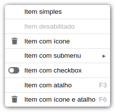
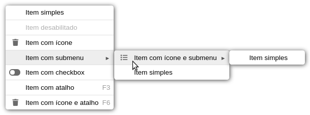

# xMenu v2.0

O componente xMenu tem o objetivo de criar um contextMenu (menu pop-up) com suas principais funcionalidades.
Ele usa javascript nativo em sua construção.

[Instalação](#instalação)<br>
[Importando](#importando)<br>
[Modo de Uso](#modo-de-uso)<br>
[Modelo](#modelo)<br>
[Parâmetro Create](#parâmetro-create)<br>
[Parâmetro Item](#parâmetro-item)<br>
[Métodos](#métodos)<br>
[Desenvolvedores](#desenvolvedores)<br>

## Instalação

Clone o repositório em um diretório local.

```sh
    git clone git@github.com:guigagb/mofo-v2.git
```

## Importando

Em seu html declare o css:
```html
    <link rel="stylesheet" href="./xMenu2.css">
```

Para usar o mofo você deve chamá-lo em seu arquivo .js através de import.
```javascript
    import xMenu from './xMenu2';
```

## Modo de Uso

É necessário um elemento no seu html com um id ou classe para usar na instância do xMenu.

```html
    <!DOCTYPE html>
    <html lang="pt-BR">
    <head>
        <title>Mofo v2.0</title>
        <link rel="stylesheet" href="./xMenu2.css">
    </head>
    <body>
        <div id="minhaDiv">Hello World!</div>
        <script src="./xMenu2.js"></script>
        <script src="example.js" type="module"></script>
    </body>
    </html>
```
No javascript iremos instanciar o objeto da seguinte forma:

<h3>Create</h3>

```javascript
    const menu = new xMenu.create({
        el: '#minhaDiv',
        items: {
            item1:{
                html: 'Item simples',
                click: ()=>{
                    alert('item simples');
                }
            }
        }
    })
```

## Modelo

<table>
    <tr>
        <th>Menu</th>
        <th>Submenu</th>
    </tr>
    <tr>
        <td></td>
        <td></td>
    </tr>
</table>

## Parâmetro Create

Create é responsável por instanciar o xMenu. Recebe um objeto como parâmetro que pode ter as seguintes propriedades passadas:

<table>
    <tr>
        <th align="center">Propriedade</th>
        <th align="center">Descrição</th>
        <th align="center">Tipo</th>
        <th align="center">Default</th>
    </tr>
    <tr>
        <td>el</td>
        <td>Id ou classe do elemento onde será instanciado o xMenu. <strong>(Obrigatório)</strong></td>
        <td align="center">String</td>
        <td align="center"></td>
    </tr>
    <tr>
        <td>buttonLeft</td>
        <td>Caso queira chamar o xMenu com o botão esquerdo do mouse informe true.
        </td>
        <td align="center">Boolean</td>
        <td align="center">False</td>
    </tr>
    <tr>
        <td>disable</td>
        <td>Desabilita todos os itens do menu.
        </td>
        <td align="center">Boolean</td>
        <td align="center">False</td>
    </tr>
    <tr>
        <td>onOpen</td>
        <td>Executa uma função sempre que abrir o menu. Possui um parâmetro callback que retorna a lista de itens do menu.
        </td>
        <td align="center">Function</td>
        <td align="center">Undefined</td>
    </tr>
    <tr>
        <td>onCreate</td>
        <td>Executa uma função uma única vez quando o menu é criado.
        </td>
        <td align="center">Function</td>
        <td align="center">Undefined</td>
    </tr>
    <tr>
        <td>Items</td>
        <td>Um objeto contendo os itens que aparecerão no menu, cada item deve ter uma chave única e sua configuração especificada. <strong>(Obrigatório)</strong>
        </td>
        <td align="center">Object</td>
        <td align="center"></td>
    </tr>
</table>

## Parâmetro Item

<p>Item que ficará visível no menu. Um item pode possuir os seguintes parâmetros:</p>

<table>
    <tr>
        <th align="center">Propriedade</th>
        <th align="center">Descrição</th>
        <th align="center">Tipo</th>
        <th align="center">Default</th>
    </tr>
    <tr>
        <td>html</td>
        <td>Texto que será apresentado no botão. Caso não seja informada essa propriedade será considerado a chave do objeto item.
        </td>
        <td align="center">String</td>
        <td align="center"></td>
    </tr>
    <tr>
        <td>icon</td>
        <td>Forneça a(s) classe(s) correspondente ao ícone que deseja utilizar.
        </td>
        <td align="center">String</td>
        <td align="center">Undefined</td>
    </tr>
    <tr>
        <td>click</td>
        <td>Função que será executada ao clicar no item.</td>
        <td align="center">Function</td>
        <td align="center"></td>
    </tr>
    <tr>
        <td>disable</td>
        <td>Caso queira criar o item específico desabilitado.</td>
        <td align="center">Boolean</td>
        <td align="center">False</td>
    </tr>
    <tr>
        <td>checkbox</td>
        <td>Cria um checkbox dentro do item
        </td>
        <td align="center">Boolean</td>
        <td align="center">False</td>
    </tr>
    <tr>
        <td>shortkey</td>
        <td>Um objeto contendo como chave o nome que será o atalho apresentado no item e como valor o número da tecla (keycode) correspondente. ex.:
    <pre>
    items:{
        item1:{
            shortkey: {'F3': 144}
        }
    }</pre>
        </td>
        <td align="center">Object</td>
        <td align="center">Undefined</td>
    </tr>
    <tr>
        <td>subMenu</td>
        <td>Um objeto contendo as propriedades de criação de um menu.
    <pre>
        item1:{
            html: 'menu',
            subMenu: {
                items:{
                    item2: {
                        html: 'subMenu',
                        click: ()=>{alert('hello')}
                    }
                }
            }
        }</pre>
        </td>
        <td align="center">Object</td>
        <td align="center">Undefined</td>
    </tr>
</table>

## Métodos
    
Esses métodos serão utilizados na variável instanciada. Ex.:<br>
```javascript
    menu.disableAll();
```

<table>
    <tr>
        <th>Método</th>
        <th align="center">Parâmetro</th>
        <th>Descrição</th>
    <tr>
    <tr>
        <td>disableAll</td>
        <td align="center">nenhum</td>
        <td>Desabilita todos os itens do menu.</td>
    </tr>
    <tr>
        <td>enableAll</td>
        <td align="center">nenhum</td>
        <td>Habilita todos os itens do menu.</td>
    </tr>
    <tr>
        <td>disableItem</td>
        <td align="center">keyItem: String</td>
        <td>Desabilita o item informado.</td>
    </tr>
    <tr>
        <td>enableItem</td>
        <td align="center">keyItem: String</td>
        <td>Habilita o item informado.</td>
    </tr>
    <tr>
        <td>enable</td>
        <td align="center">keyItem: String ,<br> value: Boolean</td>
        <td>Desabilita ou Habilita o item informado de acordo com o boolean informado.</td>
    </tr>
    <tr>
        <td>setHtml</td>
        <td align="center">keyItem: String ,<br> html: String</td>
        <td>Altera o texto html do item pelo html informado.</td>
    </tr>
    <tr>
        <td>setIcon</td>
        <td align="center">keyItem: String ,<br> icon: String</td>
        <td>Altera a classe do ícone do item pela classe do ícone informado.</td>
    </tr>
</table>

## Desenvolvedores

[Francisco Alves](https://github.com/dffrancisco)
[Guilherme Trindade](https://github.com/guigagb)    